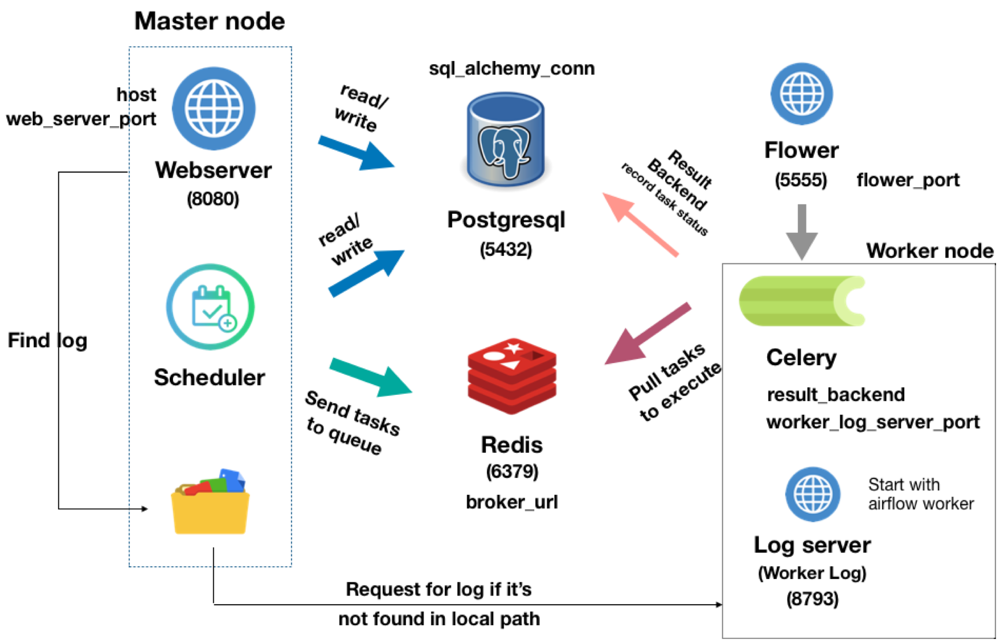

# Airflow Operations - Deployment



* [Predeployment](#predeployment)
    * [Install virtualenv](#make-sure-virtualenv-is-installed)
    * [Opt: Preprare ansible if not installed](#opt-prepare-ansible-for-deployment)
    * [Set variables](#set-variables-in-config)
    * [Ensure SSH connection](#ensure-ssh-key-is-set)
    * [Opt: Install NPM if building airflow from source](#opt-install-NPM-if-building-airflow-from-source)
    * [PreDeploy in MacOS](#preDeploy-in-MacOS)
* [Deployment](#deploy-services)
    * [Airflow](#airflow)
    * [Postresql](#postgresql)
    * [Redis](#redis)
* [Controll Airflow Service](#control-airflow)
* [Service Structure](#service-structure)
* [TODO](#todo)


## Predeployment
### Make Sure virtualenv is installed
```
pip install virtualenv
```
### [Opt] Prepare ansible for deployment
> skip if ansible is already installed
#### Opt 1: pip install in global environment
```
pip install ansible
```
#### Opt 2: Create virtualenv and install `ansible` within it
```
# source into virtualenv before executing the deploy command below
./pre-deploy.sh -e ut [-f]
source venv/bin/activate
```
* `-f` will force delete the old venv and create a new one, or it will raise error if venv already exists

### Set variables in config
* Copy `<service>/<service>-vars/<service>-dev.yml` to `<service>/<service>-vars/<service>-<env>.yml`, `<env>` might be the env name where you deploy service
* within `<service>/<service>-vars/<service>-<env>.yml`
    * change value of `base_path`，check [Service Structure](#service-structure) for recommended `base_path` location
    * change value of `env` to your `<env>` name
    * change other variables if needed

### Ensure ssh key is set
The script will download repos from github, make sure the following command works
> github (dev)
```
ssh -T git@github.com
```

### [Opt] Install NPM if building airflow from source
If deploying airflow with `--install-from-source` flag, make sure that there's `npm` installed in your environment.

### PreDeploy in MacOS
1. The deployment script use getopts which follows gnu-getopt. To let it works in MacOS, we need to install `gnu-getopt`.
```
brew install gnu-getopt
echo 'export PATH="/usr/local/opt/gnu-getopt/bin:$PATH"' >> ~/.bash_profile
```
2. `tar` type is `bsd-tar` in MacOS. To let ansible works with unarchive postresql and redis, we need to install `gnu-tar`.
> If only deploy airflow, no need for this step
```
brew install gnu-tar
echo 'export PATH="/usr/local/opt/gnu-tar/libexec/gnubin:$PATH"' >> ~/.bash_profile
```

## Deploy services
* [Airflow](#airflow)
* [Postresql](#postgresql)
* [Redis](#redis)

> Notice: `<env>` is your env name
### Postgresql
> skip to [Set Database - postgresql](#set-database---postgresql) and [Set Varieble - Postgresql](#set-varieble---postgresql) if postgresql is already installed
#### Opt1: Install from source code
```
./deploy.sh -s postgresql -e <env>
```
Download source code from [postgresql](https://www.postgresql.org/ftp/source/). The location of file is described in service structure below.
> build `postgresql` from source if you don't have root privilege.

> <span style="color:red">postgresql server is started after deployment.</span>
* start postgresql server manually
```
./bin/pg_ctl -D ./data/ -l logfile start
```
* stop postgresql server manually
```
./bin/pg_ctl -D ./data/ stop
```

#### Opt2: Install from binary
> If testing with `dev` environment, it's easier to install from binary and you just need to create db, user and grant permission manually.

#### Set database - postgresql
create user and database for airflow
```postgresql
postgres=# create database <db>;
postgres=# create user <user> with encrypted password '<pwd>';
postgres=# grant all privileges on database <db> to <user>;
```
#### Set varieble - postgresql
Check if `backend_db` in `airflow/airflow-vars/airflow-<env>.yml` is set to correct location. e.g., `postgresql://<user>:<pwd>@0.0.0.0:5432/<db>`

### redis
> skip to [Set varieble - redis](#set-varieble---redis) if redis is already installed.
```
./deploy.sh -s redis -e <env>
```
Download from [redis](https://redis.io/download). The location of file is described in service structure below.
> <span style="color:red">redis server is started in the last step of deployment.</span>
* start redis server manually
```
src/redis-server > ../redis.log 2>&1 &
```
* stop redis server manually
```
src/redis-cli shutdown
```
#### Set varieble - redis
Check if `broker_url` in `airflow/airflow-vars/airflow-<env>.yml` is set to correct location. e.g., `redis://0.0.0.0:6379/0`

### Airflow
[airflow deployment docs](docs/airflow-deployment.md)
```
./deploy.sh -s airflow -e <env> [--keep-db] [--keep-venv] [--install-from-source]
```
* `--keep-db` modify `sql_alchemy_conn` in `airflow.cfg` to change backend db from *sqlite(default)* to *postgresql* without reseting db, data such as connections, variables, and pools ... will not be deleted. <span style="color:red">Do not use this argument if backend database is already empty or `airflow.cfg` is not exist.</span>
* `--keep-venv` speeds up the deployment process without removing existed venv. However, <span style="color:red">if there're new version of libraries, don't use this argument since it may not upgrade those libraries.</span>
* `--install-from-source` clone repository from `airflow_repo` and build instead of trying to download from pypi server. Force reinstall `apache-airflow` when it's used with `--keep-venv`.
* <span style="color:red">airflow deployment includes writing config file to `var/airflow-deployment-conf.sh`, it is used for scripts to read and control the services</span>

## Control airflow
> use -h to show usage function
* control airflow from scripts, process running in backgroud
```python
# start | stop | restart | status
scripts/airflow-webserver.sh [start|stop|restart|status]
scripts/airflow-scheduler.sh [start|stop|restart|status]
scripts/airflow-worker.sh [start|stop|restart|status]
scripts/airflow-flower.sh [start|stop|restart|status]
```
* [Debug] start service manually, process running in foreground<br/>
<span style="color:red">Notification: `<airflow_venv>` path is different from venv created by `pre-deploy.sh`</span>
```python
# find airflow venv create by `deploy.sh`
''' Check `airflow_venv` in airflow/airflow-vars/airflow-<env>.yml '''
source <airflow_venv>/bin/activate

# [IMPORTANT!] export AIRFLOW_HOME
''' Check `airflow_home` in airflow/airflow-vars/airflow-<env>.yml '''
export AIRFLOW_HOME=<airflow_home>

# start airflow webserver
airflow webserver

# start airflow scheduler
airflow scheduler

# start airflow worker(celery)
airflow worker

# start ariflow flower
airflow flower
```

## Service Structure
* airflow/postgresql/redis service structure
```
<base_path>
└───airflow-app     <- path can be set by `airflow_home` variable
│   │   airflow.cfg
│   │   unittests.cfg
│   │
│   └───dags
│       └───airflow-maintainence-dags
│       └───adw
│       └───tags
│       └───...
│   │
│   └───plugins
│       └───event_plugins
│       └───...
│   │
└───logs    <- path can be set by `airflow_log` variable
│   └───dags
│   └───webserver
│   └───scheduler
│   └───worker
│   └───flower
│
└───venv       <--  path can be set by `airflow_venv` varaible
└───postgresql
│   │   postgresql-<pg_version>.tar.gz  <-- prepare this file first
│   └───postgresql-<pg_version>
│   └───pgsql
└───redis
│   │   redis-<redis_version>.tar.gz  <-- prepare this file first
│   └───redis-<redis_version>
│
└───airflow-operation <-- put this repo here
│   └───var
│   │   │   airflow-deployment-conf.sh  <-- record the variables after airflow deployment
└───airflow-sourcecode (opt)
└───airflow-plugins
```

## TODO
* airflow log rotation
* `airflow scheduler -D` not work with LocalExecutor|CeleryExecutor in osx 10.14.5
